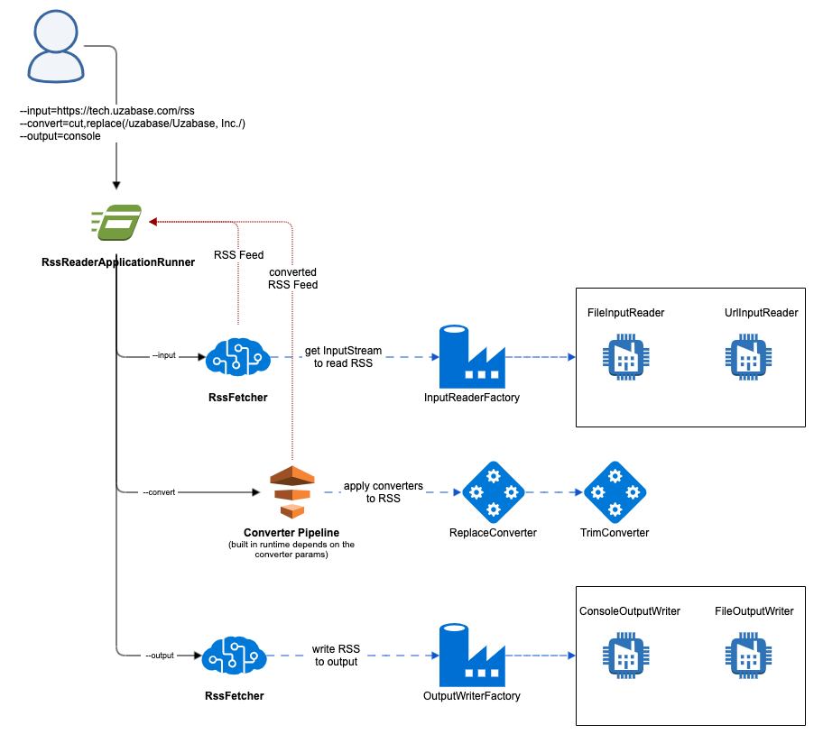

## Installation
Please install lombock plugin to be able to work in your IDE. (https://plugins.jetbrains.com/plugin/6317-lombok)

##Guide
Application is able to read the RSS feed from the URL or file, apply specific modifications to the Title and Description
of the feed and after that write the result to the specified output (file or console).

####Input parameters:  
- `--input`  
 It should or valid RSS feed URL (https://tech.uzabase.com/rss) or path to the File with valid RSS

- `--convert`  
Specify the list of converters to apply. For now support only 2 - `cut` & `replace`.
The syntax of `replace` reminds the SED replace.  
`replace(/uzabase/Max Test Uzabase/)` where `uzabase` - word to find and `Max Test Uzabase`  the word which will be replaced by.

- `--output`  
Specify where will we output our RSS feed, after it'll be processed.
There are 2 available params (`console`, or path to the file, for example `test.txt`).
By default, if nothing specified it outputs to the console.

##How to run
`./gradlew bootRun --args='--input=https://tech.uzabase.com/rss --convert=cut,replace(/Spring/Max Test/) --output=console'`  
  
This command will read the RSS from the https://tech.uzabase.com/rss, after that will apply 2 converters in the order cut -> replace. Which will trim all titles and descriptions of the feed in case if it has more than 10 characters and after that will replace all `Spring` with `Max Test`. In the end the result will be printed to the console.

##Design Schema
